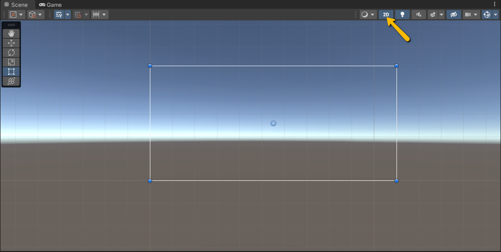
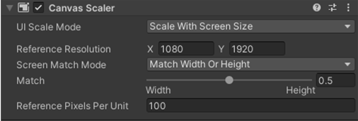
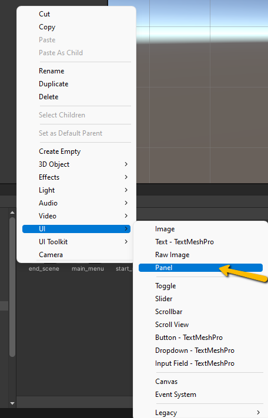
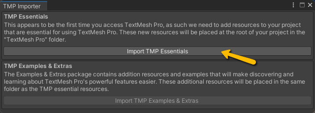

# Basic Main Menu Tutorial

This tutorial will guide you through creating a simple main menu in Unity using uGUI. The menu will include:

- A **Title**
- A **Play button**
- An **Exit button**
- A **Credits line**

---

## 1. Create the Canvas

1. In the **Hierarchy** window, right-click → `UI > Canvas`.
2. Rename the Canvas to `MainMenu`.
3. In the **Scene** window, click the **2D** button to switch to 2D view.




4. With `MainMenu` selected, check the **Canvas Scaler** component in the **Inspector**.  
   - Set it to **Scale With Screen Size** for responsive UI.
   - Set the refernce resolution to 1920 X 1080
   


---

## 2. Add a Background Panel

1. Right-click `MainMenu` → `UI > Panel`.


   
3. Rename it `pnl`.
4. Panels are containers for organizing UI elements and can also serve as a background.  
   - Set the color of the panel to your choice.
   - Make sure to adjust the alpha setting for an opaque, solid background color

---

## 3. Add a Title

1. Right-click `MainMenu` → `UI > Text - TextMeshPro`.
2. If prompted, import **TMP Essentials** (and optionally **TMP Examples & Extras**).


   
4. Rename the Text object to `txt_Title`.
5. In the **TextMeshPro** component, set the placeholder text to your game title (e.g., "Game Title").
6. Adjust the **Rect Transform** to position the title near the top of the screen.  
   - Use the **Anchor Presets** to help align it.

---

## 4. Add Buttons

### Play Button

1. Right-click `MainMenu` → `UI > Button - TextMeshPro`.
2. Rename the button `btn_Play`.
3. Rename the child TMP text element to `txt_Start` and change the text to **PLAY**.
4. Position the button below the title using the **Rect Transform**.

### Exit Button

1. Select `btn_Start`, right-click → **Duplicate**.
2. Rename the copy to `btn_Exit` and rename its child TMP text to `txt_Exit`.
3. Update the text to **EXIT**.
4. Move the Exit button below the Start button.

---

## 5. Add a Credits Line

1. Right-click `MainMenu` → `UI > Text - TextMeshPro`.
2. Rename it `txt_Credits`.
3. Set the text to display your credits (e.g., "Created by Your Name").
4. Position it at the bottom of the screen.

---

## ✅ Next Steps

- Save your scene.
- Later, attach scripts to the buttons to handle functionality like starting the game or exiting.

---

# Handling UI Functionality

Once you have your UI set up, the next step is to make it functional. This involves creating a script to handle what happens when buttons are clicked and connecting it to your UI elements. In this tutorial, we’ll create a MainMenu script that controls the main menu behavior.

#### 1. Creating the MainMenu Script

1. In your Scripts folder, create a new C# script called `MainMenu`.

2. Open the script in your editor.

The script will include the following methods:
- `PlayGame()` for loading the first game level
- `ExitGame()` for quitting the application

```csharp

   using UnityEngine;
   
   public class MainMenu : MonoBehaviour
   {
       // Loads the first level of the game
       public void PlayGame()
       {
   
       }//end PlayGame()
   
      // Quits the game application
       public void ExitGame()
       {
   
       }//end ExitGame()
   
   }//end MainMenu

```

#### 2. Unity Scene Management

To make PlayGame() work, you need to know a bit about scene management:

- **Build Settings:** Each scene in your project must be added to the Build Settings (`File` > `Build Settings`).
- **Scene Order:** Scenes have a **build index**, starting at **0**.
   - Typically, the **main menu is 0**, and the first level is 1.
   - The scene order can be changed in the build setting

In order to manage scenes via script Unity's **SceneManagment** namespace needs to be included: 
```csharp
using UnityEngine.SceneManagement;
```
To load a scene, we use the SceneManager.LoadScene(); method. This method takes two parameters:

- **Scene:** This can be specified by **build index** or **scene name** (in quotes).
   - If your scenes are in a known order, the build index can be used.
   - Since there is no guarantee of scene order, it is **often safer to use the scene name**.
   - The scene name must be:
      - **Written in quotes**
      - **Spelled exactly as it appears in your project**
      - **Included in the Build Settings**

- **Load Mode:** Determines how the new scene is loaded. Unity provides two types:
   - **Single (default):** Replaces the current scene with the new one.
   - **Additive:** Loads the new scene on top of the current scene.

> [!NOTE]
> Single load mode is the default, so this parameter does not need to be set when calling the method.

Example: Load scene with **build index** 
```csharp

     // Loads the first level of the game
       public void PlayGame()
       {
           // Load scene by build index (first level is usually index 1)
           SceneManager.LoadScene(1);

       }//end PlayGame()
```

Example: Load scene with **scene name**
```csharp

     // Loads the first level of the game
       public void PlayGame()
       {
           // Or you could load by scene name:
           SceneManager.LoadScene("Level_1");

       }//end PlayGame()
```


