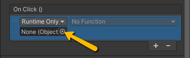

# Handling UI Functionality

Once you have your UI set up, the next step is to make it functional. This involves creating a script to handle what happens when buttons are clicked and connecting it to your UI elements. In this tutorial, we’ll create a MainMenu script that controls the main menu behavior.

## `MainMenu` Class

#### 1. Creating the MainMenu Script

1. In your Scripts folder, create a new C# script called `MainMenu`.

2. Open the script in your editor.

The script will include the following methods:
- `PlayGame()` for loading the first game level
- `ExitGame()` for quitting the application

```csharp

   using UnityEngine;
   
   public class MainMenu : MonoBehaviour
   {
       // Loads the first level of the game
       public void PlayGame()
       {
   
       }//end PlayGame()
   
      // Quits the game application
       public void ExitGame()
       {
   
       }//end ExitGame()
   
   }//end MainMenu

```

3. Attach this class the **`MainMenu` canvas game object** in the scene

---

### `PlayGame()` Method 

#### 2. Unity Scene Management

To make PlayGame() work, you need to know a bit about scene management:

- **Build Settings:** Each scene in your project must be added to the Build Settings (`File` > `Build Settings`).
- **Scene Order:** Scenes have a **build index**, starting at **0**.
   - Typically, the **main menu is 0**, and the first level is 1.
   - The scene order can be changed in the build setting

In order to manage scenes via script Unity's **SceneManagment** namespace needs to be included: 
```csharp
using UnityEngine.SceneManagement;
```
To load a scene, we use the SceneManager.LoadScene(); method. This method takes two parameters:

- **Scene:** This can be specified by **build index** or **scene name** (in quotes).
   - If your scenes are in a known order, the build index can be used.
   - Since there is no guarantee of scene order, it is **often safer to use the scene name**.
   - The scene name must be:
      - **Written in quotes**
      - **Spelled exactly as it appears in your project**
      - **Included in the Build Settings**

- **Load Mode:** Determines how the new scene is loaded. Unity provides two types:
   - **Single (default):** Replaces the current scene with the new one.
   - **Additive:** Loads the new scene on top of the current scene.

> [!NOTE]
> Single load mode is the default, so this parameter does not need to be set when calling the method.

Example: Load scene with **build index** 
```csharp

     // Loads the first level of the game
       public void PlayGame()
       {
           // Load scene by build index (first level is usually index 1)
           SceneManager.LoadScene(1);

       }//end PlayGame()
```

Example: Load scene with **scene name**
```csharp

     // Loads the first level of the game
       public void PlayGame()
       {
           // Or you could load by scene name:
           SceneManager.LoadScene("Level_1");

       }//end PlayGame()
```

---

### `ExitGame()` Method 
The `ExitGame()` method is responsible for quitting the game when the player clicks the **Exit** or **Quit** button in the main menu.
Because quitting behaves differently depending on whether the game is running in the **Unity Editor**, as a **standalone build**, or on the **web**, we use conditional code to handle each case properly.

Unity provides a built-in method for closing applications: `Application.Quit()`.
When called, this method shuts down the running player application. However, its behavior varies depending on the platform:

- **Ignored in the Editor:** `Application.Quit()` has no effect when running inside the Unity Editor; it only works in a built version of the game.
- **Used in Embedded Contexts:** If Unity is running inside another application (for example, when using Unity as a Library), refer to the Unity as a Library documentation for details on handling quitting properly.
- **Web Platform Behavior:** On web builds, `Application.Quit()` stops the **Unity Web Player** or **WebGL** runtime but does not close or reload the web page itself.

Since `Application.Quit()` is ignored in the Editor, we can add an `#if UNITY_EDITOR` condition to simulate quitting during testing. Inside this condition, we check if the editor is currently in play mode using `UnityEditor.EditorApplication.isPlaying`, and then set it to false to stop play mode; effectively mimicking a game exit.

```csharp

     // Quits the game application
       public void ExitGame()
       {
            #if UNITY_EDITOR
                // Stop play mode in the Unity Editor
                UnityEditor.EditorApplication.isPlaying = false;
            #else
                // Quit the application when running as a built game
                Application.Quit();
            #endif

       }//end ExitGame()
```

> [!IMPORTANT]
> **Always include a method to exit the game in every game build.**
---

## Connecting Buttons to the Script
With the script complete we now need to set up our UI buttons to call the correct method. 

1. Select the button in the Hierarchy.
2. In the Inspector, scroll down to the Button (Script) component and find the OnClick() section.
   - Click the + button to add a new event.



3. Drag the **MainMenu** (Canvas with the `MainMenu` script attached) into the object field.
4. From the function dropdown choose `MainMenu` > `PlayGame()` for the Play button, or `MainMenu` > `ExitGame()` for the Exit button.


## Testing the Menu
In the editor hit the play button and test  the buttons: 
- **PlayGame():** Click the button in Play mode. The game should load the first level scene.
- **ExitGame():** In the Editor, the game will stop playing. In a built application, the game will quit.

> [!WARNING]
> If the level doesn’t load when the **Play** button is pressed, make sure the **scene has been added** to the Build Settings.

This setup gives you a central script for menu functionality and a clean workflow for connecting UI buttons to game actions.

---


**[<< Return Main Menu tutorial](main-menu.md)**