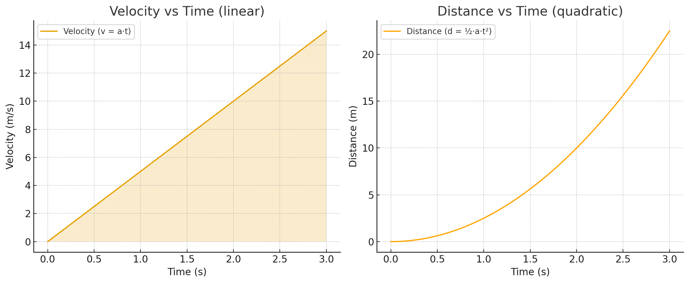

# Force-Based Movement
In Unity, a **force** is a push or pull applied to an object that makes it accelerate, just like in the real world. Using force-based movement allows Unity's **physics engine** to handle **acceleration**, **deceleration**, **collisions**, and **interactions** with other objects naturally. This creates a sense of weight and momentum, making the movement feel more realistic and immersive.

## Why Not Just Use Velocity?

Velocity-based movement is simple and often effective, but it comes with a limitation: directly setting a Rigidbody’s velocity overrides parts of Unity’s physics system. This can make objects feel unnatural because collisions, momentum, and external forces are ignored.

By using forces instead, your objects respond to the environment in a believable way. They can be pushed, pulled, slowed down, or influenced by explosions, wind, or collisions—all without extra code.

### Force vs. Velocity in Action

Here are a few examples where force-based movement shines:

- **Vehicles:** Cars in a racing game gradually accelerate and brake rather than instantly reaching top speed.
- **Rolling or sliding objects:** Balls or crates respond naturally to collisions and slopes.
- **Characters:** A player-controlled character can feel “weighty,” obeying momentum and gravity.
- **External forces:** Explosions, gusts of wind, or pushes from other objects affect motion realistically.

#### Pros and Cons of Force-Based Movement

- ✅ Produces natural, fluid acceleration and deceleration
- ✅ Fully integrates with Unity physics (collisions, mass, momentum)
- ✅ Allows external forces to influence movement

- ❌ Requires careful tuning of mass, acceleration, and drag
- ❌ Slightly more complex to implement and debug

Force-based movement is particularly useful when objects accelerate gradually, collisions matter, or you want to simulate vehicles, projectiles, or other physics-heavy interactions.

---

## Understanding Force
The foundation of force-based movement comes from **Newton’s Second Law of Motion**, which states:

$$
\vec{F} = m \cdot \vec{a}
$$

Here:

- $$\(\vec{F}\)$$ is the force applied (the push or pull)  
- $$\(m\)$$ is the object’s mass  
- $$\(\vec{a}\)$$ is the resulting acceleration  

This tells us that the same force applied to two different objects will produce different results:  
- A **light ball** accelerates quickly  
- A **heavy crate** barely budges  

Likewise, if we want the same object to accelerate faster, we must apply more force.

Another way to see this relationship is to solve for acceleration:

$$
\vec{a} = \frac{\vec{F}}{m}
$$

This is important in games: when you push a car, swing a bat, or roll a ball, the object doesn’t instantly reach its final speed. Using forces, Unity simulates this **gradual change in velocity**, giving movement a lifelike feel.

### Units of Force
Force is measured in **Newtons (N)**, which are defined as **kilograms·meters per second squared (kg·m/s²)**. This tells us how much force is required to accelerate a certain mass at a certain rate. In simpler terms, the Newton also represents the **magnitude** of the push or pull (i.e, how strong the force is). To fully describe a force, we also need to know its **direction**, because forces are **vectors**.

$$
\vec{F} = \text{magnitude} \times \text{direction}
$$


When working with forces in Unity, it’s important to understand the units being used. 
- Mass in kilograms (kg)
- Distance in meters (m)
- Time in seconds (s)
- Force in Newtons (N)

For example, applying 10 N of force to a 2 kg Rigidbody produces an acceleration of 5 m/s².

### Physics Steps

Understanding the units of **mass**, **distance**, and **force** is only part of the picture. In Unity, physics is simulated in **discrete time steps**, not continuously every frame. This means the timing of updates determines how forces change an object’s velocity and position over time, which in turn affects how movement feels in your game.

Unity calculates `Rigidbody` physics inside the `FixedUpdate()` method, rather than the usual `Update()`. This ensures consistent physics behavior regardless of frame rate. The interval between physics updates is defined by `Time.fixedDeltaTime`, which defaults to **0.02 seconds** (50 physics steps per second).

Because physics updates occur in steps, Unity computes the object’s motion incrementally. At each step:

- **Velocity increases linearly** and is updated according to acceleration (from all applied forces, including gravity, drag, or user input) incrementally each physics step:

$$
\vec{v}_{\text{new}} = \vec{v}_{\text{current}} + \vec{a} \cdot \text{FixedDeltaTime}
$$

- **Position** is updated based on the current velocity and acceleration. This **displacement grows quadratically**:

$$
\vec{d} = \vec{v}_{\text{current}} \cdot \text{FixedDeltaTime} + \frac{1}{2} \vec{a} \cdot (\text{FixedDeltaTime})^2
$$



Because `FixedDeltaTime` is small, velocity and position change gradually rather than instantly. This is why objects **accelerate smoothly**, giving movement a natural, lifelike feel.

### Other Forces Acting on Objects

Additionally, Unity automatically accounts for other forces such as **gravity**, **drag**, and **friction** at each physics step. Multiple forces combine to produce a **net force**, which determines acceleration and resulting motion. This makes force-based movement **predictable and physically consistent**, while still allowing for interactions like collisions, pushes, or environmental effects.

To determine how an object moves with multiple forces at work, we calculate the **net force**, which is simply the sum of all individual forces:

$$
\vec{F}_{\text{net}} = \vec{F}_1 + \vec{F}_2 + \dots
$$

Once we know the net force, the resulting acceleration is:

$$
\vec{a} = \frac{\vec{F}_{\text{net}}}{m}
$$

A common and important example is **gravity**. When enabled on a `Rigidbody`, Unity automatically applies gravitational force:

$$
F_g = m \cdot g
$$

Other forces can also influence objects:
- **Drag** (linear and angular damping) slows motion over time, simulating air resistance or rotational friction.
- **Physics Materials** can be applied to objects to control friction and bounciness, affecting how objects slide, roll, or bounce off surfaces.

By combining these forces—gravity, drag, user-applied pushes, and collisions—Unity calculates the net effect on each Rigidbody at every physics step. This allows movement to feel both dynamic and physically realistic, without manually adjusting positions or velocities.

> [!NOTE]
> In Unity, the default **gravity is set to -9.81 m/s²** on the **Y-axis**, matching Earth’s gravity.
> 
> This value can be changed under **`Edit` > `Project Settings` > `Physics`** if you want to simulate different environments (e.g., the Moon’s gravity).

---

## Applying force in Unity
Now that we understand **forces, vectors, mass, acceleration, and Unity’s physics steps**, it’s time to see how we can actually **apply forces** to objects in a Unity scene. The `Rigidbody` component provides several methods for influencing an object’s movement:

- `Rigidbody.AddForce()` - Applies a linear force in **world space**; changing the object's velocity.
  - The ForceMode can be set to **Force**, **Acceleration**, **Impulse**, or **VelocityChange** depending on how you want the force to affect the object.
- `Rigidbody.AddTorque()` - Applies a **rotational force (torque)**, causing it to spin around its center of mass.
- `Rigidbody.AddExplosionForce()` - **Simulates an explosion** by applying a force that **radiates outward** from a specific point, affecting nearby objects.
- `Rigidbody.AddRelativeForce()` - Applies a linear force **relative to the Rigidbody’s local axes**.
- `Rigidbody.AddRelativeTorque()` - Applies torque **relative to the Rigidbody’s local axes**.

Each of these methods has its own specific use cases, but for this lesson, we will keep things simple and focus on the most common method: `Rigidbody.AddForce`.

### `AddForce()` Method

The `Rigidbody.AddForce()` method applies a force to a Rigidbody, causing it to accelerate in the direction of that force. Unlike setting the Rigidbody’s velocity directly, this method allows Unity’s physics engine to calculate the resulting motion, taking into account:

- The object’s **mass**
- **Drag** and other damping effects
- Other forces such as **gravity** or **collisions**


The method takes two parameters:
- **Vector3 force** – a vector that specifies the direction and strength of the push.
- **ForceMode mode** – determines how the force is applied, such as gradually over time, instantly, or ignoring mass.

Using these parameters, you can make objects move more realistically, respond to collisions naturally, and create different types of movement behaviors depending on the chosen `ForceMode`.

## Force Modes
Each of the Rigidbody force methods allows you to influence an object's movement, but the exact effect depends on how the force is applied. Unity provides four distinct `ForceMode` parameters to control this behavior. 
- `ForceMode.Force` – **Continuous force over time**, mass affects acceleration; good for gradual, realistic motion (e.g., car accelerating).
- `ForceMode.Acceleration` – **Continuous acceleration ignoring mass**; good for uniform forces like wind or gravity.
- `ForceMode.Impulse` – **Instant force affected by mass**; good for sudden bursts like jumps or explosions.
- `ForceMode.VelocityChange` – **Instant force ignoring mass**; good for responsive or arcade-style movement.

Mathematically, these modes determine **how the force contributes to velocity and displacement each physics step**. Continuous forces accumulate gradually through multiple `FixedUpdate` steps, while instantaneous forces change the Rigidbody’s velocity immediately. Choosing the correct ForceMode is essential for achieving the **desired feel of movement** in your game.


### 1. ForceMode.VelocityChange
Previously, when we implemented `_rigidbody.velocity = Speed * Direction;` we were **ignoring Unity’s physics system**, effectively telling the Rigidbody, _“Your velocity is exactly this,”_ without considering mass, gravity, drag, or collisions. While this may seem simple, it often produces **unnatural movement** in dynamic scenes.

Using `AddForce()` with `ForceMode.VelocityChange` works differently. Instead of directly setting the Rigidbody’s velocity, we **apply a change in velocity**, calculated as the **delta velocity** ($$\Delta \vec{v}$$) , to the Rigidbody:

$$
\Delta \vec{v} = \vec{v}_{\text{target}} - \vec{v}_{\text{current}}
$$

- $$\Delta \vec{v}$$ → change in velocity  
- $$\vec{v}_{\text{target}}$$ → target velocity  
- $$\vec{v}_{\text{current}}$$ → current velocity

This mode **ignores mass**, meaning the Rigidbody will reach the target velocity immediately, while still respecting other forces like gravity and collisions.

---

### 2. ForceMode.Impulse
`ForceMode.Impulse` is conceptually very similar to `ForceMode.VelocityChange`, but with one key difference: **it accounts for the Rigidbody's mass**. An impulse applies a sudden force that produces an immediate change in velocity proportional to the object’s mass:

$$
\text{appliedImpulse} = \Delta \vec{v} * {m}
$$

- `appliedImpulse` → vector passed to `AddForce`  
- $$\Delta \vec{v}$$ → change in velocity  
- $$m$$ → mass of the Rigidbody  

By scaling the delta velocity by mass, Impulse produces an **instantaneous, realistic response** that interacts naturally with Unity’s physics, including collisions and drag. Think of it as giving a heavier object a proportionally stronger push to achieve the same change in motion as a lighter object.

---

### 3. ForceMode.Force

`ForceMode.Force` applies a continuous force to the Rigidbody. Unlike `ForceMode.VelocityChange` or `ForceMode.Impulse`, this force is applied gradually over time, and the Rigidbody’s mass directly influences the resulting acceleration:

$$
\vec{a} = \frac{\vec{F}_{\text{net}}}{m}
$$

In many tutorials, you’ll see ForceMode.Force implemented with **arbitrary acceleration values**, such as: 
```csharp
Vector3 acceleration = 5f * direction;
Vector3 appliedForce = acceleration * _rigidbody.mass;
_rigidbody.AddForce(appliedForce, ForceMode.Force);

```
While arbitrary values work, a more predictable approach uses physics to compute the exact force needed based on a **target change in velocity** (i.e., $${\Delta \vec{v}}$$) and a desired **acceleration time** (i.e., $${t_{\text{acceleration}}}$$):

$$
\vec{a} = \frac{\Delta \vec{v}}{t_{\text{acceleration}}}
$$

Where:

- $$\(\Delta \vec{v}\)$$ → change in velocity you want  
- $$\(t_{\text{acceleration}}\)$$ → duration in **seconds** over which the object should reach the target velocity  

Then the force is calculated as:

$$
\vec{F} = m \cdot \vec{a}
$$

#### Acceleration Over Time

As explained in the [Physics Steps](/#physics-steps) section, Unity processes physics in **discrete steps** (`FixedUpdate`) rather than continuously. This means that when you apply a continuous force or acceleration (`ForceMode.Force` or `ForceMode.Acceleration`), Unity **doesn't update velocity all at once**. Instead, each physics step applies only a fraction of the total acceleration. 

For example, if acceleration is $$\(5 \ \text{m/s}^2\)$$ and `FixedDeltaTime = 0.02` s:

$$
\vec{d} = \frac{1}{2} \cdot 5 \cdot 0.02^2 = 0.001 \ \text{m}
$$

At the first physics step, the displacement is very small. Over multiple steps, **velocity accumulates**, and the object moves farther. Other forces, such as **gravity**, **drag**, and **friction**, also influence the motion.

The **acceleration time** ( $$\(t_{\text{acceleration}}\)$$ )is the **total real-world time** you want the object to take to reach the target velocity.
- Larger acceleration time → slower acceleration, more gradual movement
- Smaller acceleration time → faster acceleration, more abrupt movement

> [!IMPORTANT]
Unity automatically distributes the required acceleration across the number of physics steps that occur during the acceleration time.**

This calculation ensures the `Rigidbody` accelerates toward the target velocity **predictably and consistently**, while still respecting Unity’s physics system, including gravity, drag, and collisions. Using this approach, you can achieve smooth, gradual acceleration for physics-driven objects like vehicles, sliding crates, or characters, without relying on arbitrary _“magic numbers.”_

---

#### 4. ForceMode.Acceleration
`ForceMode.Acceleration` applies a continuous acceleration to the Rigidbody, ignoring the object’s mass. Unlike `ForceMode.Force`, where heavier objects require proportionally more force to achieve the same acceleration, `ForceMode.Acceleration` lets you directly set the acceleration:

$$
\vec{a} = \frac{\Delta \vec{v}}{t_{\text{acceleration}}}
$$

**No calculation for force is needed**; simply specify the desired acceleration, and Unity updates the Rigidbody’s velocity each physics step.

This mode is particularly useful when you want **uniform effects**, such as:
- Gravity-like forces applied manually
- Wind or current affecting objects regardless of mass
- Environmental effects like conveyor belts or moving platforms

Because mass is ignored, the same acceleration is applied to all objects, whether they are light or heavy.

---

## Refactoring `MoveRigidbody` with Force
Now that we understand how different `ForceMode` options affect movement, it makes sense to refactor our `MoveRigidbody` class to take advantage of them. Instead of directly setting `rigidbody.velocity` (which bypasses physics), we’ll shift to force-based movement. This allows Unity’s physics system to handle acceleration, drag, and collisions while still providing us with the flexibility to choose between instant, gradual, or mass-independent motion through the selected `ForceMode`.

### Updating Fields 
To leverage the different ways motion can be applied with force, we will need to be able to set what `ForceMode` we want applied. To do this, we will create a new `[SerlizedField]`:

```csharp
    [SerializeField]
    [Tooltip("Controls how movement forces are applied:\n" +
             "• Force – Gradual, realistic acceleration (affected by mass).\n" +
             "• Acceleration – Gradual but ignores mass (like wind).\n" +
             "• Impulse – Instant burst, affected by mass (like a jump or explosion).\n" +
             "• VelocityChange – Instant burst, ignores mass (arcade-style movement).")]
    private ForceMode _forceMode = ForceMode.Force;

```

> [!NOTE]
> While we could keep the tooltip short (e.g., _“Controls how movement forces are applied”_), level designers may not be familiar with all the available ForceMode options. Expanding the tooltip into multiple lines gives them helpful context and reduces ambiguity.

#### Speed and Acceleration 
To implement **force-based movement**, we first need to define how **speed** and **acceleration** will work. Unlike directly setting the Rigidbody's velocity, we now treat `Speed` as the **target speed** we want the object to reach.

When using `ForceMode.Force` or `ForceMode.Acceleration`, there are two ways to control acceleration:
- Acceleration multiplier (`_accelerationMultiplier`) – a user-defined value applied each physics step to scale the force or acceleration. This is simple to implement and tweak, but it is an arbitrary _"magic number"_ and must be tuned carefully for smooth motion.
- Acceleration time (`_accelerationTime`) – calculate the force needed to reach the target speed over a desired duration, producing smoother, more predictable motion.

We use a flag (`_useAccelerationTime`) to determine which method to apply, giving us flexibility to choose between a simple multiplier or time-based acceleration for different gameplay situations.

```csharp
    [SerializeField]
    [Range(0f, MAX_SPEED)]
    [Tooltip("Target speed for the object’s movement. Clamped to MAX_SPEED.")]
    private float _targetSpeed = 5f;
    
    [SerializeField]
    [Tooltip("Acceleration multiplier applied to the target speed. \n" +
             "• Determines how quickly the object reaches the target speed when using ForceMode: Force or Acceleration.\n" +
             "• Larger values result in faster acceleration.")]
    private float _accelerationMultiplier = 100f;
    
    [SerializeField]
    [Tooltip("Enable to calculate force based on acceleration time instead of using a fixed acceleration multiplier. \n" +
             "• Produces smoother, time-based ramp-up to the target speed.")]
    private bool _useAccelerationTime = false;
    
    [SerializeField]
    [Tooltip("Time in seconds to reach the target speed when using acceleration time.\n" +
             "• Smaller values make the object reach the target speed faster.\n" +
             "• Larger values create slower, smoother acceleration.")]
    private float _accelerationTime = 0.5f;
```

#### Reference to Mass
To properly calculate _Impulse_ and to ensure the gradual acceleration has enough force to move an object, we need to reference the object's **mass**. This can easily be done using the `_rigidBody.mass` property. While this is pretty easy to write, we can simplify it by creating a field for `_mass` and then in `Awake()` set it to the Rigidbody's mass value. It might only be a few characters shorter, but even little things like this can speed up the process. 

**Create** the following fields: 

```csharp
    //Reference to the object's Mass
    private float _mass;
```
**Set** the reference for `_mass` in the `Awake()` method

```csharp
 private void Awake()
    {
        // Validate initial speed and direction via properties
        Speed = _speed;
        Direction = _direction;
        
        //Set reference to the Rigidbody component
        _rigidBody = GetComponent<Rigidbody>(); 
        
        //Ensure that Rigidbody is dynamic
        _rigidBody.isKinematic = false; 
        
        //Set reference to the object's mass
        _mass = _rigidBody.mass;

    }//end Awake()
```

---

## Update `Move()` Calculations

Previously, our `Move()` method was directly changing the `linearVelocity` of the object's Rigidbody. However, we now want to update this to calculate the different forces we may want to apply, depending on our force mode. Since we need to perform calculations and check for the force mode, we will refactor the `Move()` method to only run the calculations and then call the `ApplyForce()` method to apply the correct force calculation depending on the force mode. 

**Update** the `Move()` method

```chsharp


```
### How it works 
 1.  Removed the direct setting of the Rigibody's `linear velocity`.
 2.  An `appliedVelocity` calculation replaces the calculation for linear velocity and will be used when using `ForceMode.VelocityChange`.
 3.  `appliedImpulse` is the `appliedVelocity` multiplied by mass and will be the calculation for using `ForceMode.Impulse`
 4.  When using `ForceMode.Force` or `ForceMode.Acceleration`, we calculate the `appliedForce`, which is the `appliedVelocity` multiplied by our `_acceleration` multiplier.
 5.  However, if `_useAccelerationTime` is true, we need to calculate:
     - The `appliedAcceleration`, which is the rate of `Speed` over the `_accelerationTime`
     - Determine the `appliedAccelerationForce`, which is the `appliedAcceleration` multiplied by both the object's `_mass` and `Direction`
     - Set `appliedForce` equal to the new `appliedAcceleratedForce` value
   
> [!NOTE]  
> In the `if(_useAccelerationTime)` condition, we assign the resulting value back to `appliedForce`. This allows us to pass the `appliedForce` to our next method (i.e., `ApplyForce`) without having to check a second time. 


If spped is too fast include Continuous collision detection 

Clamp at max speed 


Stop


